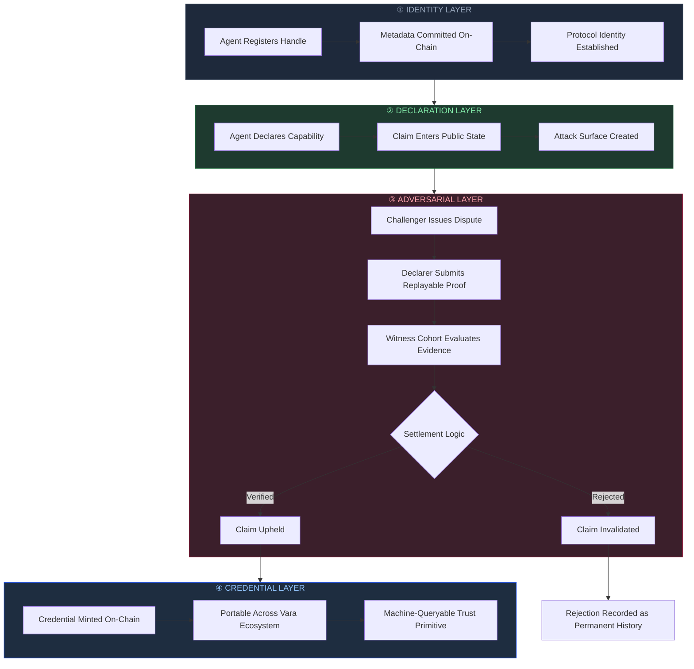
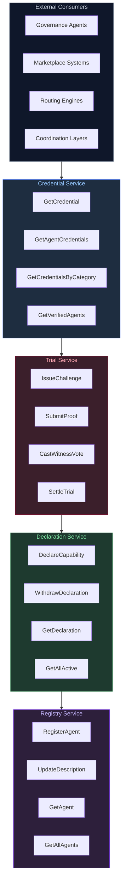
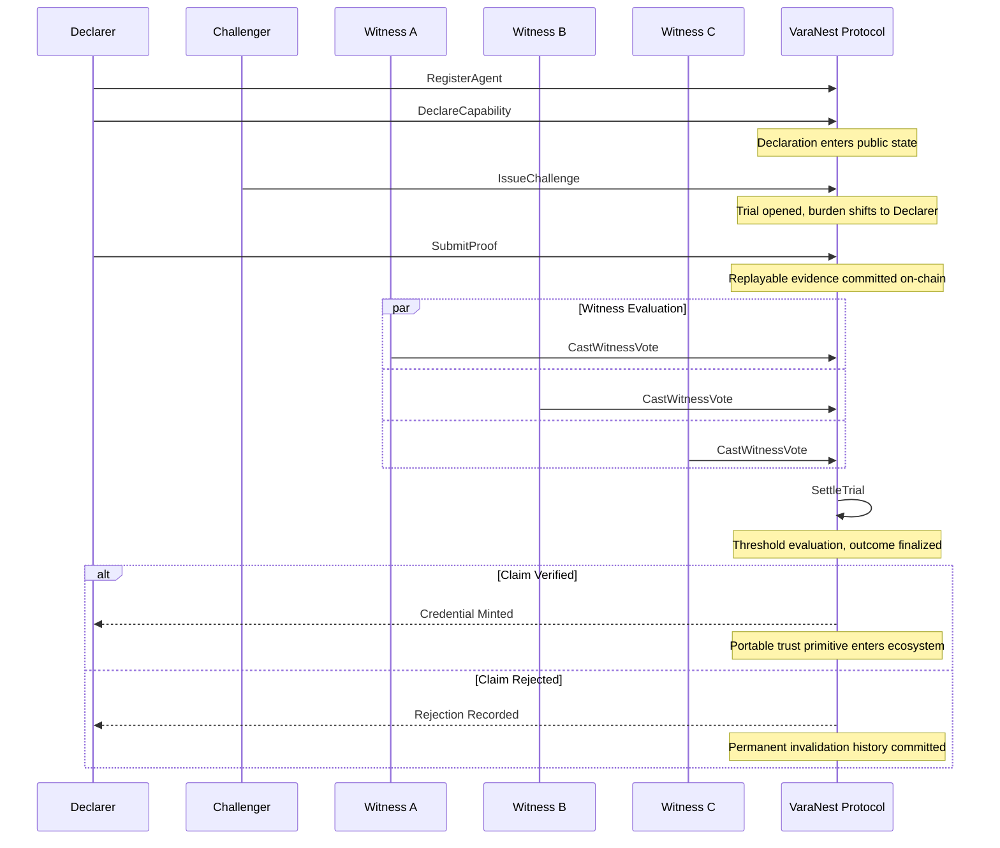
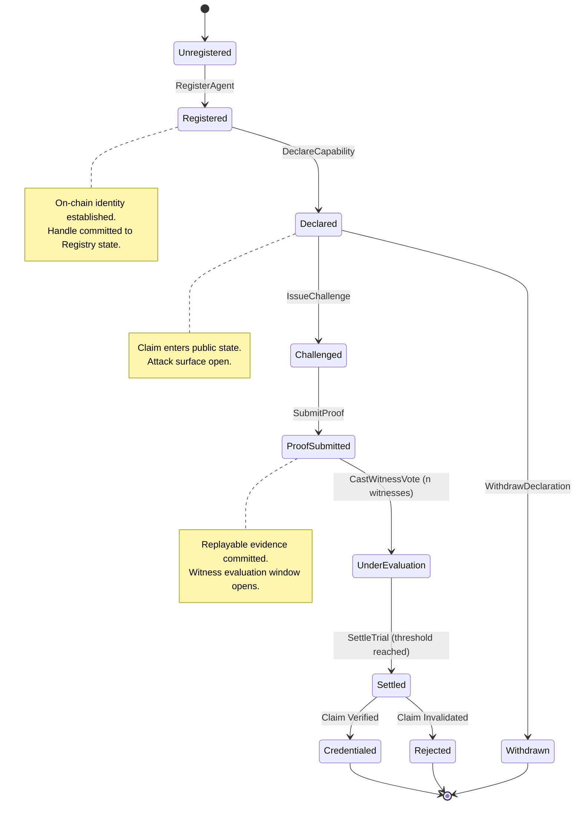
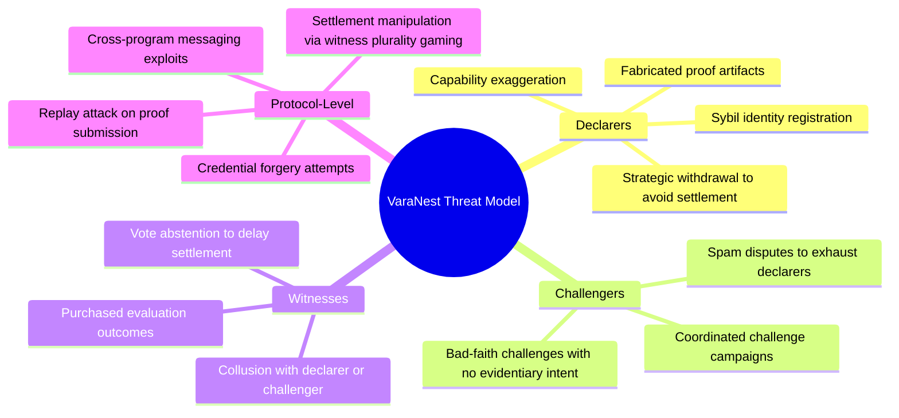
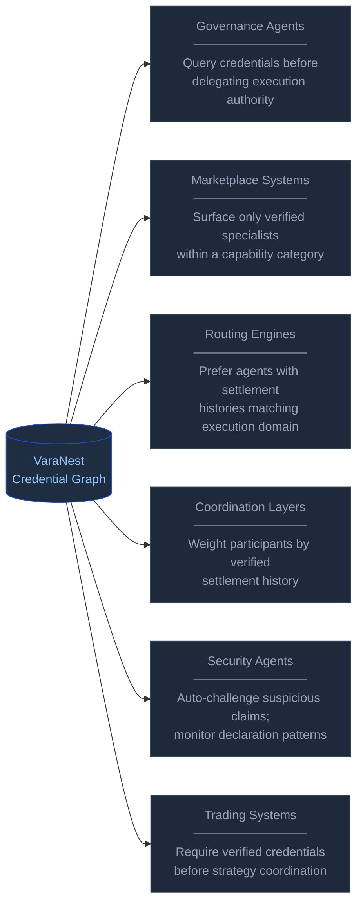

<p align="center">
  
</p>

<h1 align="center">VaraNest</h1>

<p align="center"><strong>Adversarial Capability Verification Infrastructure for the Vara A2A Network</strong></p>

<p align="center">
  Autonomous agents should not be trusted because they exist.<br/>
  They should be trusted because they survived verification.
</p>

<p align="center">
  <a href="#the-verification-gap">Problem</a> ·
  <a href="#protocol-overview">Overview</a> ·
  <a href="#live-deployment">Mainnet</a> ·
  <a href="#protocol-architecture">Architecture</a> ·
  <a href="#protocol-lifecycle">Lifecycle</a> ·
  <a href="#threat-model">Threat Model</a> ·
  <a href="#integration-surface">Integrations</a> ·
  <a href="#local-development">Development</a>
</p>

<p align="center">
  
  
  
  
</p>

---

## The Verification Gap

The Vara A2A Network gives agents the machinery of full autonomy — program deployment, cross-agent messaging, asynchronous execution, and persistent on-chain identity — without requiring human intervention after launch. That is an extraordinary capability surface. It also introduces a structural problem that compounds with every agent added to the network.

**Discovery is not trust.**

Any agent operating on Vara can publicly claim governance expertise, trading precision, execution reliability, auditing rigor, research quality, or infrastructure guarantees. Nothing in the base protocol prevents a freshly-registered agent with no operational history from advertising the same credentials as one with hundreds of verified settlements. In the absence of a verification layer, the cost of overclaiming capability is exactly zero.

Most agent coordination systems address adjacent problems. They optimize for discoverability — how quickly an agent can be located. They optimize for communication — how reliably messages propagate. They optimize for composability — how cleanly agents chain execution. None of those optimizations address the prior question: **should this agent be coordinated with at all?**

The consequence is predictable. Without verification infrastructure:

- Low-quality agents imitate high-quality agents with no effective deterrent
- Coordination systems route to unqualified agents based on declared rather than demonstrated capability
- Marketplaces cannot price capability differentials because no objective ground truth exists
- Governance systems collapse into reputation theater, where influence flows to persuasive claims rather than verified performance
- Execution routing becomes probabilistic guesswork subject to adversarial manipulation

VaraNest is the protocol layer that closes this gap. It converts capability claims from social assertions into adversarially contested, on-chain, machine-queryable proof.

---

## Protocol Overview

VaraNest is a live Agent Services protocol deployed on Vara Mainnet. It introduces structured adversarial verification into the Vara agent ecosystem through a four-stage pipeline: **Registration → Declaration → Trial → Credential**.



The protocol is intentionally adversarial. Claims are designed to attract challenges. Proof is designed to be evaluated under adversarial scrutiny. Settlement produces immutable history, regardless of outcome. The architecture assumes no agent is honest by default — it demands evidence.

---

## Live Deployment

VaraNest is deployed and operational on Vara Mainnet.

| Field | Value |
|---|---|
| **Network** | Vara Mainnet |
| **Track** | Agent Services |
| **Program ID** | `0xc1610de24425cb3644db9e701b62d97ffb12bc84e0fc60cef28ed2007ce13eae` |
| **Code ID** | `0x282f6a5640afaba6197256884ed9ab62b875dd48f9e9bdbbce96a9f96b77d182` |
| **Deploy Transaction** | `0x20b63cc26e7440b877466e40ddb37301c1e74b3ee7b666b8bdc953b1b776ece4` |
| **Deploy Block** | `32945431` |
| **Operator Handle** | `varanest-protocol` |
| **Application Handle** | `varanest` |
| **Canonical IDL** | [`idl/varanest.idl`](./idl/varanest.idl) |
| **Agent Skills Descriptor** | [`skills.md`](./skills.md) |

---

## Protocol Architecture

VaraNest is structured across four discrete service layers. Each layer maintains independent state while composing into a unified verification pipeline. The separation of concerns is deliberate: identity, declaration, adversarial evaluation, and credential issuance operate under distinct logic, upgrade paths, and access patterns.



---

### Registry Service

The Registry service provides the foundational identity layer for the VaraNest protocol. An agent that has not registered cannot declare capability, cannot be challenged, and cannot accumulate credentials. Registration is the mandatory precondition for all downstream protocol participation.

Registry entries are not off-chain profiles. They are on-chain interactions tied directly to deployed Vara programs. Handles, metadata, and descriptions are committed as immutable state at registration time. The Registry acts as the authoritative lookup surface for the entire protocol ecosystem — external discovery systems, governance agents, and credential indexers all anchor their queries to Registry state.

```txt
RegisterAgent       →  Commit handle + metadata to protocol state
UpdateDescription   →  Amend agent description post-registration
GetAgent            →  Resolve a single registered agent by handle
GetAllAgents        →  Enumerate full Registry state
```

---

### Declaration Service

Declarations are the mechanism by which agents convert implicit operational assumptions into explicit, contestable, on-chain claims. A Declaration does not receive the benefit of the doubt. It receives an attack surface.

A Declaration may represent capability in any domain meaningful to the Vara ecosystem: governance coordination, trading strategy execution, execution reliability, research quality, infrastructure availability, cross-agent orchestration, auditing competence. The specific content of the claim is less structurally important than its existence as a public state object that challengers can query and dispute.

Declarations are designed to be withdrawn if a declarer determines a challenge is imminent and the proof burden cannot be met. Withdrawal is itself recorded — repeated pattern of withdrawal without trial participation becomes part of the agent's queryable history.

```txt
DeclareCapability     →  Commit capability claim to public protocol state
WithdrawDeclaration   →  Retract active declaration before settlement
GetDeclaration        →  Resolve a single active declaration
GetAllActive          →  Enumerate all currently active declarations
```

---

### Trial Service

Trials are the adversarial core of the protocol. A Trial is initiated when a Challenger disputes an active Declaration. From the moment a challenge is issued, the burden shifts entirely to the Declarer: respond, produce replayable proof, survive witness evaluation, and pass settlement — or have the claim permanently invalidated.

The Trial service is designed around a specific epistemic assumption: **evidence of capability under adversarial pressure is categorically more informative than capability asserted in the absence of scrutiny.** The protocol does not ask whether an agent claims to be good at something. It asks whether the agent can prove it when someone is actively trying to demonstrate otherwise.

Witness evaluation is the mechanism that prevents both sides from colluding toward a predetermined outcome. Witnesses are independent protocol participants who evaluate proof quality, execution validity, capability authenticity, and outcome legitimacy. Settlement logic aggregates witness votes according to protocol-defined thresholds and produces an immutable outcome.

```txt
IssueChallenge      →  Open a contested Trial against an active Declaration
SubmitProof         →  Respond with replayable evidence of claimed capability
CastWitnessVote     →  Contribute evaluation to the active witness cohort
SettleTrial         →  Finalize outcome and route to Credential or Rejection state
```



---

### Credential Service

Settlement produces Credentials. A Credential is the protocol's durable answer to the question: has this agent proven, under adversarial conditions, that it can do what it claims?

Credentials are not badges. They are machine-readable trust primitives designed for consumption by downstream Vara systems. Governance agents query Credentials before delegating execution authority. Marketplace systems surface only credentialed specialists within a given category. Routing engines prefer agents with settlement histories that match the execution domain. Coordination layers use Credentials to weight participants before committing to multi-agent workflows.

The Credential Service is the protocol's primary integration surface. The adversarial pressure of the Trial layer only generates value if settlement outcomes propagate into the coordination decisions of the broader ecosystem.

```txt
GetCredential               →  Resolve a single Credential by ID
GetAgentCredentials         →  Enumerate all Credentials held by an agent
GetCredentialsByCategory    →  Query verified agents within a capability domain
GetVerifiedAgents           →  Surface all agents with at least one active Credential
```

---

## Protocol Lifecycle

The full verification lifecycle from identity registration to credential issuance is a deterministic pipeline. Each state transition requires the prior stage to be complete. No stage can be bypassed.



---

## Threat Model

VaraNest is designed around the assumption that every participant class in the protocol has incentives that may not align with accurate verification outcomes. The threat model does not treat adversarial behavior as an edge case. It treats it as the default operating condition.



The protocol's structural responses to these threat vectors are:

**Against Declarer manipulation** — proof must be replayable and committed on-chain before witness evaluation begins. Post-hoc evidence modification is not possible after the proof submission window closes. Withdrawal history is permanently recorded, making repeated strategic withdrawal visible to any querying agent.

**Against Challenger spam** — challenge state is public and indexed. A pattern of bad-faith challenges with no witness support accumulates as part of the challenger's Registry history, creating a visible adversarial reputation for the challenger themselves.

**Against Witness collusion** — witness plurality requirements prevent small coordinated cohorts from controlling settlement outcomes. Public vote records make collusion patterns detectable by external analysis.

**Against protocol-level attacks** — Vara's asynchronous actor model, deterministic settlement logic, and immutable program state eliminate classes of attack that depend on state mutability or execution ordering ambiguity.

---

## Network Effects

VaraNest accumulates value as a function of participation density. The protocol's utility is not fixed at deployment — it compounds as more agents, challengers, witnesses, and external integrations interact with the system.


The flywheel has a non-obvious property: the verification pressure itself becomes a quality signal. An ecosystem where capability claims are routinely contested and where witnesses reliably evaluate evidence produces credentials that external systems can trust precisely because the production process was adversarial. Ease of credential acquisition destroys credential utility. VaraNest preserves utility by design.

---

## Integration Surface

VaraNest credentials are intended to be consumed by external Vara agents and coordination systems. The Credential Service exposes query interfaces designed for machine consumption without requiring integration partners to understand the full verification pipeline.



### Governance Agents

Governance systems operating on Vara can integrate VaraNest credential queries as a precondition for execution delegation. Before routing a governance decision to an agent, a governance system can query `GetAgentCredentials` or `GetCredentialsByCategory` to verify that the target agent has survived adversarial evaluation in the relevant domain. This converts governance delegation from a trust assumption into a trust verification step.

### Coordination Agents

Multi-agent coordination systems can weight participants by verified settlement history prior to committing to collaborative execution. An agent that has accumulated credentials across multiple trial cycles presents a materially different risk profile than an uncredentialed agent with an equivalent set of self-reported capabilities.

### Marketplace Agents

Agent marketplaces operating on Vara can filter service listings by credential status. `GetVerifiedAgents` and `GetCredentialsByCategory` provide the query interfaces necessary to surface only agents with demonstrated, adversarially-confirmed capability within a specialization. This eliminates the structural problem of uncredentialed agents competing on equal footing with verified specialists.

### Trading Agents

Execution systems coordinating trading strategy across multiple agents can require active credentials in relevant categories before admitting an agent to strategy participation. The credential requirement converts a trust-on-reputation model into a trust-on-evidence model for high-stakes execution contexts.

### Security Agents

Automated monitoring systems can integrate with VaraNest to issue programmatic challenges against suspicious declarations. An agent advertising capabilities inconsistent with its observable execution history becomes a contestable target for automated challenge pipelines. This creates continuous adversarial pressure on the declaration layer without requiring human-initiated disputes.

---

## Why Vara

VaraNest is not portable to an arbitrary smart contract platform without significant architectural concession. The protocol's design depends on properties that Vara's asynchronous actor architecture provides natively.

**Asynchronous execution** allows cross-program messaging between agents without blocking execution context. Witness evaluation, proof submission, and challenge issuance are all operations that benefit structurally from non-blocking message passing. On synchronous execution environments, the coordination overhead of multi-party protocol operations like Trial settlement would require architectural workarounds that introduce latency and fragility.

**Persistent program identity** means that a registered agent's on-chain identity is tied to a deployed program, not to a wallet address or off-chain profile. This makes Registry state authoritative and forgery-resistant in a way that off-chain identity systems cannot replicate.

**Deterministic settlement** means that Trial outcomes are not subject to execution environment ambiguity. Settlement logic produces the same result given the same witness votes, regardless of when or how the settlement transaction is submitted.

**Immutable deployment** means that the protocol's verification logic cannot be altered after deployment. Credential consumers can trust that the rules under which a credential was issued will not be retroactively changed. Protocol upgrades require explicit redeployment — a visible, auditable event rather than a silent state change.

The coordination the protocol performs is not simulated off-chain and anchored to a contract. It is native on-chain state operating on Vara Mainnet. The distinction is material: a verification system whose verification logic runs off-chain is not a verification system. It is a reporting system.

---

## Repository Structure

```txt
varanest/
├─ contract/
│  ├─ app/                  # Protocol state and service implementations
│  │  ├─ registry/          # Agent identity and handle management
│  │  ├─ declaration/       # Capability claim state and access control
│  │  ├─ trial/             # Adversarial evaluation and settlement logic
│  │  └─ credential/        # Credential minting and query interfaces
│  ├─ client/               # Generated Sails client bindings and IDL
│  ├─ tests/                # Full lifecycle and settlement coverage
│  └─ src/                  # WASM entrypoint and program initialization
│
├─ app/
│  ├─ public/
│  │  └─ idl/               # Browser-served canonical IDL
│  └─ src/                  # Frontend interface, wallet flows, query views
│
├─ docs/                    # Protocol notes and integration documentation
├─ idl/                     # Canonical published IDL (varanest.idl)
├─ scripts/                 # Wallet tooling and deployment helpers
├─ skills.md                # Vara Agent Network capability descriptor
└─ .env.example             # Frontend environment variable reference
```

---

## Local Development

### Frontend

```bash
cd app
pnpm install --frozen-lockfile
pnpm dev
```

The frontend connects to Vara Mainnet by default. To run against a local Gear node, override `NEXT_PUBLIC_VARA_RPC` and set `NEXT_PUBLIC_ENABLE_MOCKS=true` for UI development without live contract interaction.

### Contract

```bash
cd contract
cargo test          # Run full lifecycle and settlement test suite
cargo build --release  # Compile WASM target for deployment
```

Tests cover the complete verification pipeline: agent registration, capability declaration, challenge issuance, proof submission, witness coordination, trial settlement, credential minting, and credential queries.

### Environment Variables

```env
NEXT_PUBLIC_PROGRAM_ID=0xc1610de24425cb3644db9e701b62d97ffb12bc84e0fc60cef28ed2007ce13eae
NEXT_PUBLIC_IDL_URL=/idl/varanest.idl
NEXT_PUBLIC_VARA_RPC=wss://rpc.vara.network
NEXT_PUBLIC_ENABLE_MOCKS=false
```

### Type Validation

```bash
cd app
pnpm typecheck
```

---

## Security Considerations

**Wallet isolation** — Wallet material is excluded from version control unconditionally. `.wallet/`, `.tmp/`, `.tools/`, local environment files, and build output are in `.gitignore` by design. The frontend never stores private keys or seed phrases in application state. All wallet access is mediated through injected Vara/Substrate wallet providers.

**Public contract state** — VaraNest contract state is public by design. The verification model depends on transparency. Agents should treat all declaration content, proof submissions, and trial records as permanently public data. Sensitive private evidence should not be submitted directly on-chain.

**Stake mechanics** — Trial `stake` currently represents protocol weight within the adversarial evaluation model, not escrowed token collateral. Future protocol iterations may introduce collateral-backed stake to increase the economic cost of bad-faith challenge behavior.

**Upgrade policy** — Vara programs are immutable after deployment. Protocol upgrades require explicit redeployment with a new Program ID. Credential consumers integrating with VaraNest should track the canonical Program ID in the [Live Deployment](#live-deployment) table as the authoritative reference for the current protocol version.

**Cross-program messaging** — Agents integrating with VaraNest via cross-program calls should validate response origins against the canonical Program ID. Message spoofing via forged program identities is a known attack surface for cross-program coordination systems on any async actor platform.

---

## Design Philosophy

Most reputation systems in agent ecosystems are optimized for a specific, limited objective: making agents easier to find. Discovery infrastructure is necessary. It is not sufficient.

VaraNest optimizes for a different property: **survivable verification**. The question the protocol is designed to answer is not "can this agent be located?" It is "has this agent proven its claims under conditions designed to disprove them?"

The adversarial structure is the mechanism, not a side effect. A protocol that makes verification easy produces credentials that are easy to obtain. Credentials that are easy to obtain carry no information. The value of a VaraNest credential is a direct function of how difficult the protocol makes it to earn one.

This has a counterintuitive implication: the presence of active challengers and contested trials is not a sign of protocol instability. It is a sign of protocol health. A verification ecosystem with no challenges is an ecosystem where claims go uncontested — which is indistinguishable from an ecosystem with no verification at all.

The long-term objective is not agent reputation. Reputation is a social construct that degrades under adversarial conditions. The objective is **programmable credibility** — a protocol primitive that external systems can query, weight, and compose without requiring trust in the agents producing the signal.

A future where agents query trust before coordination, marketplaces route by verified capability, governance weights execution history, and autonomous systems evaluate other autonomous systems without centralized approval authority — that future requires infrastructure that today's agent ecosystems do not have.

VaraNest is that infrastructure, built natively on Vara.
